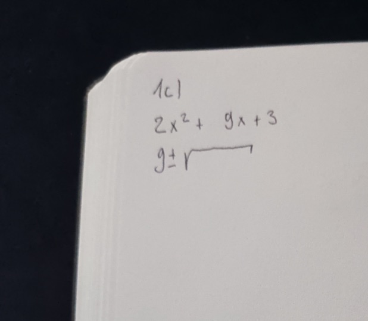
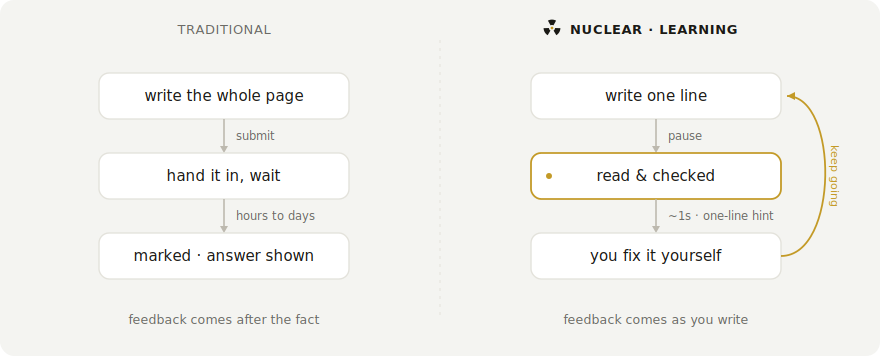
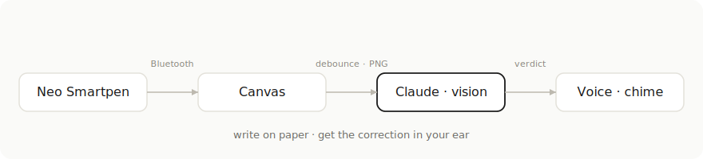
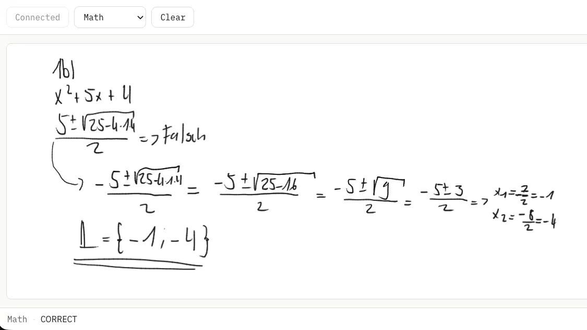
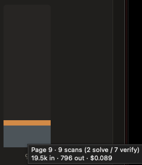

<p align="center">
  
</p>

# nuclear-learning

   

> You antisocial folks will particularly like this one

Real-time feedback for handwritten work. You write on paper with a Neo Smartpen. The strokes stream into the browser over Bluetooth, and a moment after you pause the page goes to Claude. It reads the page and tells you, spoken aloud or with a chime, whether it found a mistake. The hint is one line and names the first error. It does not give the answer, so you make the correction yourself and carry on.

<p align="center">
  
</p>

The same work starts on real Ncode paper, written with the Neo pen.

<p align="center">
  
</p>

## Traditional vs. nuclear

Most practice runs a slow loop. You finish a page, hand it in, and find out what went wrong much later, usually by reading the answer. This runs the loop while you write. The page is checked the moment you pause, and a one-line hint points at the error so you fix it and carry on.

<p align="center">
  <picture>
    <source media="(prefers-color-scheme: dark)" srcset="docs/loop-dark.svg">
    
  </picture>
</p>

## How it works

The pen streams (x, y, pressure) points over Web Bluetooth. The app draws them onto a canvas, fitting the page coordinates to the drawing area as it goes. When you pause for a beat (a per-mode debounce), the page is cropped to just the ink and sent to the Claude API as a vision message under the active mode's system prompt. There is no separate OCR step. Claude reads the ink directly.

<p align="center">
  <picture>
    <source media="(prefers-color-scheme: dark)" srcset="docs/pipeline-dark.svg">
    
  </picture>
</p>

It stays quiet while your work is correct. A mistake interrupts you with a one-line spoken hint, and a finished, correct result with a single chime. The model solves the problem itself and verifies the answer before it judges, so it stays silent unless it is sure.

When a solution is finished and right you get that single chime. Below, a quadratic that was written with a dropped sign, caught, corrected on the page, and confirmed.

<p align="center">
  
</p>

## Modes

A mode is a system prompt plus a few settings. Four ship by default: math, chemistry notation, German, and freeform note-reading. Each one decides how the work is judged and how the result reaches you.

To add one, append an object to `config/modes.json`, or build it in the Presets tab, no code changes either way:

```json
{
  "id": "physics",
  "label": "Physics",
  "feedbackStyle": "both",
  "debounceMs": 1200,
  "errorChecking": true,
  "systemPrompt": "You are checking handwritten physics working. Reply OK while it is correct but unfinished, CORRECT when finished and right, otherwise name the first error in one short sentence."
}
```

`feedbackStyle` is `"spoken"`, `"chime"`, or `"both"`. `debounceMs` is how long to wait after the last stroke before checking. `errorChecking` is `true` for grading modes, and `false` for read-only modes that should never be given error-detector context.

## The interface

The app is three tabs. The pad is where you work: connect the pen, choose a mode, and write. It keeps the controls to a thin strip and gives the rest to the page.

<p align="center">
  
</p>

Usage logs every scan's token cost and charts it per page, so a change to a model or a setting moves the number live. It has a dark theme too.

Presets is where the modes live. A mode's prompt, debounce, feedback style, and whether it caches a solved answer are all editable in place, with the engine settings, model, effort, image size, and prices, folded into the panel at the top. The defaults still come from `config/modes.json` and `config/settings.json`; this just edits them without a reload.

<p align="center">
  
</p>

## What it costs

A page is scanned many times as you write, so cost matters. To measure it I played a deliberately clumsy student: one messy page, worked out in pieces and left to re-scan again and again as it came together.

<p align="center">
  
</p>

Nine scans of that page came to about nine cents.

<p align="center">
  
</p>

This holds because the work is split across models by how hard each part is. The first scan that can read a complete problem is solved once, in full, by the strong model, and the worked answer is kept as a short checklist. Every later scan compares the work so far against that checklist, so it runs on a cheaper, faster model. When that cheap pass thinks the answer is finished, the strong model takes one last look to confirm the result before the chime. If it disagrees, the cheap model is dropped for the rest of that problem. The strong model runs twice, to work the problem out and to sign off the result, and the cheap one carries the repetitive middle.

Two things keep the scan count down. A scan only fires once enough new ink has arrived, so pausing to think spends nothing, and once a problem is solved it is never solved again. Most of what is left is input, the cropped image and the prompt re-sent on each scan, so a smaller image or fewer scans move the number more than anything on the output side.

A second routing mode is available, off by default. A quick classifier judges each problem as simple or multi-step the first time it can read it, then every scan runs on the strong model, at low effort for a simple problem and your solve effort for a multi-step one. Which mode comes out cheaper depends on the problems you give it. Both live in the Presets panel.

## Staying coherent across a page

A page is checked many times as you write, and the scans stay consistent across the page. The same correction is never replayed: a verdict is spoken or chimed only when it differs from the last one, so while you are still fixing "Step 3: check your sign" it stays on screen and stops talking. Each request also carries the verdicts already given as context, so Claude stays consistent with itself, never re-flagging a line it already confirmed and holding the same first unresolved error until you fix it. Feedback follows you to the problem you are on, so several problems can share a page (1a, 1b, 2) and it grades the lowest unfinished one. Requests run one at a time and in order, so verdicts never arrive out of sequence.

Pressing Clear wipes the pad and resets the page context for a clean start on the next problem. Switching mode resets the context the same way but keeps your drawing.

## Running it

You need Node and a Chromium-based browser. Web Bluetooth is not in Safari or Firefox, and Brave has it off by default (enable it at `brave://flags/#brave-web-bluetooth-api`).

```bash
npm install
cp .env.example .env   # then put your Anthropic API key in .env
npm run dev
```

Open the printed localhost URL, click Connect pen, pick a mode, and start writing. Pairing only works over `localhost` or `https`, and on macOS the browser needs Bluetooth permission (System Settings, Privacy and Security, Bluetooth).

The key is read from `VITE_ANTHROPIC_API_KEY` and used directly from the browser, so it is visible to anyone who can open the page. Keep this local and use a key you can rotate.

## Settings

Everything tunable lives in `config/settings.json`, and can also be changed live in the Presets tab.

| Setting | What it does |
|---|---|
| `api.solveModel` / `verifyModel` / `confirmModel` | the per-role models: a strong model solves and confirms, a cheaper one runs the routine checks |
| `api.maxTokens` | room for the model's reasoning pass plus the one-line verdict |
| `canvas.maxScale` | zoom cap, higher renders your writing bigger and lower renders it smaller |
| `canvas.pressureMultiplier` | how much stroke width responds to pen pressure |
| `audio.voiceLang`, `audio.rate` | spoken-feedback voice and speed |
| `audio.chimeCorrect`, `audio.chimeError` | drop `.mp3` files in `public/` for real chimes, otherwise a tone is synthesised |

## Hardware

| Item | Price |
|---|---|
| Neo Smartpen (M1 / M1+ or compatible) | CHF 74 to 129 |
| D1 refills (3-pack) | CHF 5 |
| Ncode paper (print your own or buy a notebook) | CHF 0 to 16 |
| Any BLE earbud (optional, for spoken feedback in your ear) | CHF 15 to 20 |

## License

MIT
