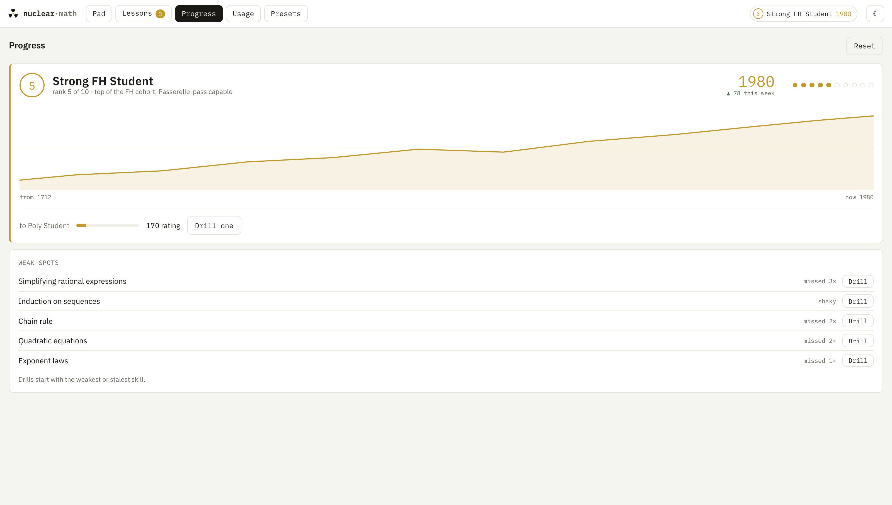
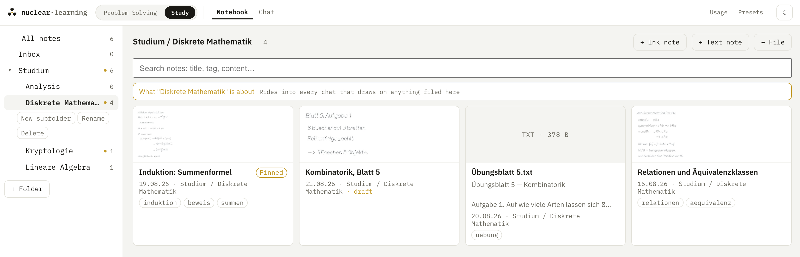
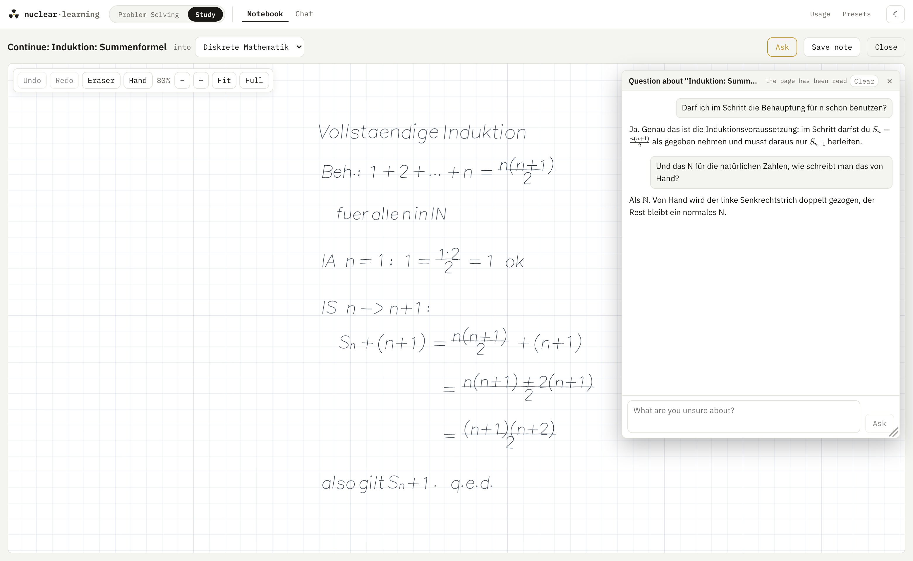
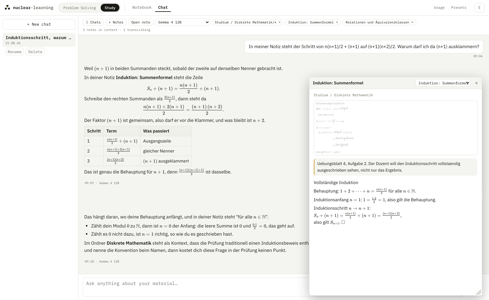

<p align="center">
  
</p>

<h3 align="center">A notebook with a chat that has read it, beside a problem-solving pipeline that grades handwritten math on request and names the rule behind the mistake.</h3>

<p align="center">
  <a href="#problem-solving">Problem Solving</a> •
  <a href="#study">Study</a> •
  <a href="#how-it-works">How it works</a> •
  <a href="#run-it">Run it</a> •
  <a href="#hardware">Hardware</a>
</p>

<p align="center">
  <a href="LICENSE"></a>
  <a href="https://vuejs.org"></a>
  <a href="https://www.typescriptlang.org"></a>
  <a href="https://ollama.com"></a>
</p>

Two halves share one window, and the switch at the top says which one you are in. Study is the notebook: school material of any subject, written in ink, typed, pasted from the clipboard, or dropped in as Word and PDF files, with a persistent chat grounded in it. Problem Solving is the pad and the machinery around it, a granular loop that grades your settled work against a solution it worked out first and names the rule a wrong step broke. It ships tuned for school mathematics, down to a map of 125 skills that steers what you practice next.

You write with a Neo Smartpen on paper, its strokes streaming into the browser over Web Bluetooth, or with a graphics tablet straight onto the page. Either way a vision model reads the handwriting directly from the page image, so nothing gets typed and nothing gets photographed. Four buttons drive the loop: problem written, check, hint, finish. An ask box sits beside them for typed questions about the page in hand ("what if I substitute here?"), answered from your own route. Every reply comes back spoken, in Swiss German.

<p align="center">
  <picture>
    <source media="(prefers-color-scheme: dark)" srcset="docs/pad-dark.png">
    
  </picture>
  <br><sub>A check mid-problem. The feedback names the rule the step broke, and applying it stays your job.</sub>
</p>

## Problem Solving

One page is one problem, and the loop around it is deliberately granular. The statement is read and solved once up front, so every later request has something to grade against. A check judges only settled work, and a hint escalates one rung at a time. What the page taught you leaves as a review card and as a mark on a skill map. The grader ships as a school mathematics teacher, and a new preset clones it, so the same loop starts from that tuned baseline when you point it at something else.

### The hint names the rule

Hints climb a ladder, one rung per failed fix, the way a human tutor escalates. The first rung is a diagnosis: what the written step actually did, and the rule that kind of step must keep, stated so it holds with any numbers. If your fix fails, the next rung states the corrected step, that one line with its value and only that line; the steps after it stay yours. The last rung repeats the corrected step and points at the printed solutions. A question mark written next to a flagged spot advances the ladder without waiting for a failed attempt.

Written out, for one wrong step in 10⁻² × 10³, spoken as words the way the app says them:

| Rung | What comes back |
|---|---|
| The diagnosis | "You multiplied the exponents in ten to the minus two times ten cubed; when powers of the same base are multiplied, the exponents are added." |
| The corrected step | "With the same base the exponents are added: ten to the minus two times ten cubed is ten to the first." |
| The printed solutions | "The step reads ten to the first; the full working for this problem is in the printed solutions." |

The same ladder serves when nothing is wrong and you are stuck, and it climbs constraints: first the condition your next step must satisfy and where it attaches, then that condition written out with your numbers, then the next line itself. A definition on its own never counts as a hint. Pressing hint again without writing anything goes one level deeper; write something and the judgement starts fresh.

The first rung carries no values from your page for a reason. In a randomized trial with about a thousand math students, an answer-revealing chatbot made exam scores worse than no help at all, while the same model behind a no-reveal guardrail helped.

### Nothing runs on its own

Each button press evaluates the page exactly once, so a half-written line is never judged behind your back. A check always answers out loud: correct-so-far is spoken, a still-standing error is repeated word for word, and only a wrong answer chimes. Ask twice, hear it twice.

### Paper conventions still count

A line struck through, or marked "falsch" with an arrow to the redo, is settled business and stays unflagged. Rewriting a solution from scratch supersedes the flagged attempt, so the newest version is what gets judged, and an intermediate result is left alone while you are still simplifying it. Done is declared with the finish button: the page only comes back correct when every question the statement asks has its answer, so a multi-part problem cannot pass with part b) still open.

### Write on a tablet instead

A graphics tablet is the second way in: pick Tablet as the input source and write straight onto the page, no pen hardware involved. Strokes live as objects in a fixed page space, so undo removes a whole stroke, the eraser lifts the strokes it touches, and zooming never changes how thick the ink sits on the page. Samples are drawn as one curve rather than as the chain of straight segments they arrive in, so handwriting keeps its shape instead of reading faceted. Pressure barely moves the line; the width set in Presets is the width you get. The ink is a dark blue-black rather than black, and that is a legibility decision: the marks that decide a line of algebra are its smallest ones, an exponent, a prime, a minus, a fraction bar, and fine detail is resolved by brightness rather than by hue. So the ink keeps almost no colour of its own and nearly all of its contrast against the paper, stopping one step short of black, which is the step that takes the glare out of a long session. Colour then stays free to mean something on the rare occasion you use it. Change it in Presets and the notebook comes with it: every stroke ever written takes the new colour, and the picture each note keeps for its grid is re-rendered from the strokes in the background, with the writing, the transcript and the date untouched. The pen's lower button is the eraser for exactly as long as you hold it, and undo sits on Z, which peels off stroke after stroke while it is held. A kariert grid lies under the ink on screen and stays out of every export, and the Full button fills the screen with the page so the tablet's active area maps onto it about 1:1.

### Review cards from your own mistakes

Every mistake you fix becomes a review card, built from your error and the worked solution already in hand, so what comes back on the spacing schedule is the actual fix. Corrected errors are the most memorable kind of correction, and they fade after about a week; the expanding schedule is what makes the fix permanent.

The ask box feeds the same deck: a typed question is itself a signal about what you hold loosely. When a question reveals a rule you are unsure of, it comes back as a recall card on that rule; when it reaches for a technique adjacent to your route, it comes back as a small practice task on a fresh instance. Casual questions produce nothing. Cards are written on the underlying rule in textbook terms, and knowledge the deck already tests is not added twice.

### Weak spots over scores

Every page tags the skills behind it against a fixed map of 125 skills, from sign handling up through the chain rule and proof by induction. The Progress tab turns that into a weak-spot list with a drill button per skill: a generated practice problem pitched so you get it right about four times in five, plus a next-up suggestion for the session. There is deliberately no rating and no rank; the map steers practice and nothing else.

<p align="center">
  <picture>
    <source media="(prefers-color-scheme: dark)" srcset="docs/progress-dark.png">
    
  </picture>
</p>

## Study

The half with no grader in it. Material comes in, gets filed, and gets questioned in a chat that can only answer from what you attached to it.

### A notebook, and the board you write it on

School notes of any subject live in Study, on its Notebook tab. Write them in ink in a full-pane editor, type them, or paste them: Cmd+V with a screenshot or photo on the clipboard files it as a note on the spot. Every image note is transcribed in the background by a small vision model into searchable text with $-LaTeX math, and every ink note can be reopened and continued later, on the writing rather than a screen above it. Notes organize into nested folders with tags, pins, and full-text search; each carries a context field only you write, for the assignment or source it belongs to. The panes and the note window resize by drag and keep their size.

<p align="center">
  <picture>
    <source media="(prefers-color-scheme: dark)" srcset="docs/notebook-dark.png">
    
  </picture>
</p>

Titles stay yours. Nothing names a note behind your back, and the button that does it costs nothing in the ordinary case: the transcriber already read the page, so its suggestion is kept from that call and handed over when you press for it.

The writing surface itself is a board, not a sheet. A note grows in whatever direction you keep writing, with no edge to run into: scroll or drag to move around, zoom out to a twentieth to see a whole session at once, and press Fit to frame everything you have written. Only the ink is exported, cropped to what you drew, so empty board costs nothing. A page-sized note transcribes as the single clean image it always did; once a board grows past what one picture can hold and still keep the handwriting readable, it is cut into regions in reading order, each at full pen weight, and read one request per region. The regions do not overlap and every cut is pulled onto empty board, so no line is read twice and none is sliced in half; the transcript is those readings joined in order. A board of twenty pages takes a couple of minutes and says how far it has got while it works. The solving pad stays a page, because there one page is one problem.

Writing is saved as you write it. A moment after the pen stops, the board is on disk: the first line makes the note, everything after it updates the same note, and leaving the tab or the browser takes nothing with it. Nothing on that path costs anything, because a half-written page is not worth reading; Save is what finishes a note and sends the handwriting to be transcribed. Until then the note sits in the notebook marked as a draft. A screenshot pasted onto the board is an object on it rather than a mode you enter: tap it with the pen to move, resize or turn it, tap off it to carry on writing, and ink still goes over the top. Lock it and it becomes part of the page: the pen goes straight through, so a picture you are taking notes on top of cannot be nudged out from under them by a stroke that clipped its edge.

Documents you already have go into the same folders. Drop a Word file, a PDF, or a text file onto a folder and it is filed as a note beside the handwritten ones, or pick it with + File; dragging a note onto a folder moves it there too. A Word document is read in place, headings, lists, tables and pictures included, without a converter library and without a trip through Word: the app unzips the file and renders it. A PDF opens in the browser's own viewer, and whatever text a document carries is kept with it, so it turns up in search and attaches to a chat like any other note.

### Asking mid-page

A question window floats over the board, and it answers the question. No hints, no next steps, nothing about the rest of the page: it is there for the word, the sign, the rule you are not sure applies, and the work stays yours. It reads the page as text rather than as a picture, and the text it uses is the one that already exists, so a run of questions about a page you are not currently writing on costs a small text call each and nothing else. Write a paragraph and the next question reads the page once; every question after that reuses that reading. Nothing it reads is written back over the note's own transcript.

<p align="center">
  <picture>
    <source media="(prefers-color-scheme: dark)" srcset="docs/board-dark.png">
    
  </picture>
</p>

### The chat that has read it

The Chat tab beside the notebook is a persistent study chat over it. Conversations survive restarts, and each carries its own attachments: single notes or whole folder subtrees, resolved to transcripts at send time, so answers are grounded in what you actually wrote and name the note they draw on. Any attached note opens in a window that floats over the thread, movable and resizable, so the page an answer is about is readable while you ask the next question. Replies render as full markdown with live KaTeX: headings, lists, tables, code, and formulas inside all of them. Each conversation also picks the model it answers on, from the shipped list or any id you type, so the chat working through a proof and the one drilling vocabulary need not share a tier; a chat that picks nothing follows the Presets default, and every answer carries the name of the model that wrote it. The grader on the pad and the study chat stay separate personas.

<p align="center">
  <picture>
    <source media="(prefers-color-scheme: dark)" srcset="docs/chat-dark.png">
    
  </picture>
</p>

## Underneath both

### Everything survives the browser

All state mirrors to disk through the dev server: settings, decks, skills, notes, chats, and the images, ink and documents behind them land in a local `data/` folder that git ignores. Clearing browser data loses nothing; the next start restores everything from disk.

A notebook is only useful where you need it, so `npm run dump` pours it back out as text: it lists the folders, you pick some, and each one is written as a Markdown file with its notes, their context, and the background you wrote for the module. It reads a database directory, so it works the same on the live one and on a snapshot pulled back off the box.

One disk is not a backup, so `npm run backup` mirrors that folder to a server of your own over SSH. Every push writes a full snapshot whose unchanged files are hardlinks into the previous one, so a month of history costs about one copy plus what changed. Set `NL_BACKUP_HOST` and `NL_BACKUP_PATH` in `.env` and check the connection with `npm run backup:check`; add `NL_BACKUP_EVERY_MIN` and the dev server pushes on its own while you write. `npm run backup:pull` brings the newest snapshot back into a fresh folder, never over your live one unless you ask it to.

One disk is also not two machines. `./data` is a clone of a private repository of its own, so the notes, the handwriting and the archive follow you: `npm install` on a machine that has never seen them clones the database, installs a small agent that pulls and pushes every few minutes, and runs one round straight away. The dev server does the same when it boots, which is the moment that matters, because it means the work from the machine you left is already there before you start typing. `npm run sync:status` says what is local, what is remote and whether the agent is up. When two machines edited the same note between two syncs, the newer edit wins the file and both versions are written to `./data-conflicts/` first, so the decision is never a loss. Git is one shared timeline and a delete travels along it, which is why the snapshots above stay: sync makes you portable, backup is what you restore from.

### What a page actually spends

Every request is answered by Ollama on this machine, so a page costs nothing and the only thing it spends is time. The Usage tab counts what that time is made of: tokens read and written, broken down by purpose and then by model, with a bar per problem splitting what the model was given from what it wrote back. It also names the model each request ran on, so moving a chat or the pad from E4B to 12B shows up as a heavier bar instead of as a bigger bill.

<p align="center">
  <picture>
    <source media="(prefers-color-scheme: dark)" srcset="docs/usage-dark.png">
    
  </picture>
</p>

## How it works

Solving runs as a pipeline of five requests, each with its own job and its own model. The pen streams (x, y, pressure) points onto a canvas; the tablet draws into the same page space through pointer events. On every button press the page is cropped to just the ink and sent as a vision message to Ollama on this machine; the model reads the handwriting itself, and no page, question or transcript leaves the laptop.

| Button | What happens | Model |
|---|---|---|
| Problem written | Reads the statement and solves it once, every sub-question of it; the answers become an internal checklist | Gemma 4 E4B, thinking first |
| Check | Grades the settled work against the checklist | Gemma 4 E4B, answering straight |
| Hint | Names the next constraint your route must satisfy | Gemma 4 E4B, thinking first |
| Ask (typed) | Answers a free question about the page, grounded in your work and the checklist | Gemma 4 E4B, thinking first |
| Finish | Judges the declared-done page against the full checklist | Gemma 4 E4B, thinking first |

One model answers all five, and what separates them is whether it thinks before it writes. Check is the press that repeats, sometimes every other line, so it answers straight and comes back in seconds; the four that decide something are worth the wait. Reading a note in the Study half asks for no thinking either, and that is measured rather than thrifty: the same page came back in 7 seconds against 35, and the fast reading was the accurate one. Every one of these is a model id and an effort in Presets, so a page that deserves 12B can have it.

Forgetting the first button costs nothing: every other request, the ask box included, runs the capture pass itself when no checklist exists yet. The capture echoes the statement into the side panel, editable: fix a misread given by hand and it re-solves against your text, which from then on outranks the ink. Sub-questions a check has confirmed stay confirmed; later checks are barred from re-flagging approved work unless you visibly rework it.

Grading follows school convention. A simplification task assumes its expressions are defined, so the tutor accepts the textbook answer without absolute-value bars, while a lost solution of an equation is always flagged. Everything is spoken as words ("x squared", "the square root of two") and the German voice keeps Swiss spelling.

## Presets

The grader is one system prompt plus a few settings, edited live in the Presets tab or in `config/modes.json`. New presets clone the shipped math grader, so a variant starts from the tuned baseline with its conventions, hint ladder, and self-correction protocol. Pointing a variant at another subject is a prompt edit; the 125-skill map and the drill generator behind Progress stay mathematical. `feedbackStyle` is `"spoken"`, `"chime"`, or `"both"`. The engine settings live in `config/settings.json` and the same panel: models, effort, image quality, the auto-clear after a finished page, and the tablet ink (colour, pen width, smoothing, grid, page aspect).

## Run it

You need Node, a Chromium-based browser, and Ollama. No key, no account, and no request that leaves the machine.

```bash
brew install ollama                       # or ollama.com/download
OLLAMA_CONTEXT_LENGTH=32768 ollama serve &

ollama pull gemma4:e4b                    # reads the pages, answers the chat
ollama pull embeddinggemma                # the notebook's retrieval index

npm install
npm run dev
```

Open the printed URL, connect the pen, and write. Connecting is always the button; the app never grabs the pen on its own. With a graphics tablet there is nothing to pair: choose Tablet as the input source at the top left and write.

> [!NOTE]
> Web Bluetooth is not in Safari or Firefox, and Brave ships with it off (enable it at `brave://flags/#brave-web-bluetooth-api`). Pairing works over `localhost` or `https`, and on macOS the browser needs Bluetooth permission.

> [!IMPORTANT]
> That context length is not optional. Ollama loads a model with 4096 tokens unless it is told otherwise, and one page image plus the pad's system prompt is already more than that, so every request would come back 400. Set `OLLAMA_CONTEXT_LENGTH` wherever the server is started for good: a launchd agent on macOS, the systemd unit on Linux.

## Hardware

| Item | Price |
|---|---|
| Neo Smartpen (M1 / M1+ or compatible) | CHF 74 to 129 |
| D1 refills (3-pack) | CHF 5 |
| Ncode paper (print your own or buy a notebook) | CHF 0 to 16 |
| Any BLE earbud (optional, for spoken feedback in your ear) | CHF 15 to 20 |

Or skip the pen entirely: any graphics tablet the browser sees as a pointer works (developed against a Wacom One M), used from about CHF 30.

## License

[MIT](LICENSE)
