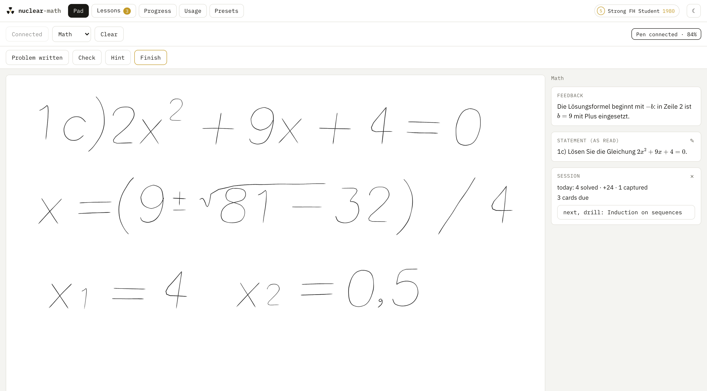
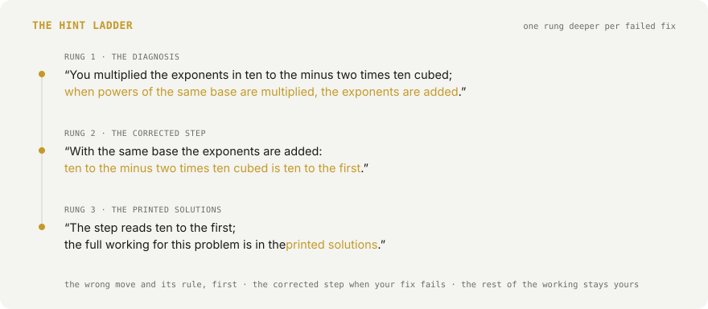
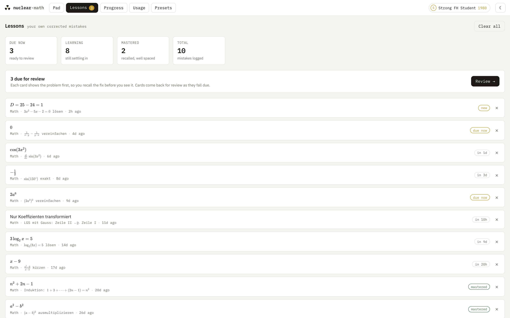
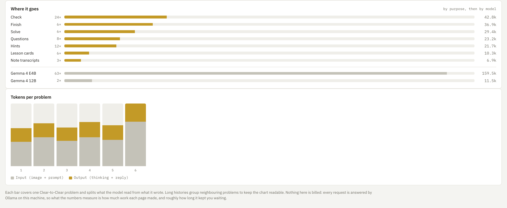

<p align="center">
  
</p>

<h3 align="center">A notebook with a chat that has read it, beside a problem-solving pipeline that grades handwritten math on request and names the rule behind the mistake.</h3>

<p align="center">
  <a href="#problem-solving">Problem Solving</a> •
  <a href="#notes">Notes</a> •
  <a href="#how-it-works">How it works</a> •
  <a href="#run-it">Run it</a> •
  <a href="#hardware">Hardware</a>
</p>

<p align="center">
  <a href="LICENSE"></a>
  <a href="https://vuejs.org"></a>
  <a href="https://www.typescriptlang.org"></a>
  
  
</p>

Two halves share one window. **Notes** is the notebook: school material of any subject, written in ink, typed, pasted from the clipboard, or dropped in as Word and PDF files, with a persistent study chat grounded in it. **Problem Solving** is the pad and the machinery around it, a granular loop that grades your settled work against a solution it worked out first and names the rule a wrong step broke. It ships tuned for school mathematics, down to a map of 125 skills that steers what you practice next.

You write with a Neo Smartpen on paper, its strokes streaming into the browser over Web Bluetooth, or with a graphics tablet straight onto the page. Either way a vision model reads the handwriting directly from the page image, so nothing gets typed and nothing gets photographed. Four buttons drive the loop: problem written, check, hint, finish. An ask box sits beside them for typed questions about the page in hand ("what if I substitute here?"), answered from your own route. Every reply comes back spoken, in Swiss German.

<p align="center">
  <picture>
    <source media="(prefers-color-scheme: dark)" srcset="docs/pad-dark.png">
    
  </picture>
  <br><sub>A check mid-problem. The diagnosis names the violated rule; applying it stays your job.</sub>
</p>

## Problem Solving

One page is one problem, and the loop around it is deliberately granular. The statement is read and solved once up front, so every later request has something to grade against; checks judge only settled work, hints escalate one rung at a time, and the finish button is what declares a page done. What the page taught you leaves as a review card and as a mark on a skill map. The grader ships as a school mathematics teacher, and a new preset clones it, so the same loop starts from that tuned baseline when you point it at something else.

### The hint names the rule

Hints climb a ladder, one rung per failed fix, the way a human tutor escalates. The first rung is a diagnosis: what the written step actually did, and the rule that kind of step must keep, stated so it holds with any numbers. If your fix fails, the next rung states the corrected step, that one line with its value and only that line; the steps after it stay yours. The last rung repeats the corrected step and points at the printed solutions. A question mark written next to a flagged spot advances the ladder without waiting for a failed attempt.

<p align="center">
  <picture>
    <source media="(prefers-color-scheme: dark)" srcset="docs/ladder-dark.svg">
    
  </picture>
</p>

The same ladder serves when nothing is wrong and you are stuck, and it climbs constraints: first the condition your next step must satisfy and where it attaches, then that condition written out with your numbers, then the next line itself. A definition on its own never counts as a hint. Pressing hint again without writing anything goes one level deeper; write something and the judgement starts fresh.

The first rung carries no values from your page for a reason. In a randomized trial with about a thousand math students, an answer-revealing chatbot made exam scores worse than no help at all, while the same model behind a no-reveal guardrail helped.

### Nothing runs on its own

Each button press evaluates the page exactly once, so a half-written line is never judged behind your back. A check always answers out loud: correct-so-far is spoken, a still-standing error is repeated word for word, and only a wrong answer chimes. Ask twice, hear it twice.

### Paper conventions still count

A line struck through, or marked "falsch" with an arrow to the redo, is settled business and stays unflagged. Rewriting a solution from scratch supersedes the flagged attempt, so the newest version is what gets judged, and an intermediate result is left alone while you are still simplifying it. Done is declared with the finish button: the page only comes back correct when every question the statement asks has its answer, so a multi-part problem cannot pass with part b) still open.

### Write on a tablet instead

A graphics tablet is the second way in: pick Tablet as the input source and write straight onto the page, no pen hardware involved. Strokes live as objects in a fixed page space, so undo removes a whole stroke, the eraser lifts the strokes it touches, and zooming never changes how thick the ink sits on the page. Pressure barely moves the line; the width set in Presets is the width you get. The pen's lower barrel button is undo, and holding it (or Ctrl+Z) peels off stroke after stroke until you let go. A kariert grid lies under the ink on screen and stays out of every export, and the Full button fills the screen with the page so the tablet's active area maps onto it about 1:1.

### Review cards from your own mistakes

Every mistake you fix becomes a review card, built from your error and the worked solution already in hand, so what comes back on the spacing schedule is the actual fix. Corrected errors are the most memorable kind of correction, and they fade after about a week; the expanding schedule is what makes the fix permanent.

The ask box feeds the same deck: a typed question is itself a signal about what you hold loosely. When a question reveals a rule you are unsure of, it comes back as a recall card on that rule; when it reaches for a technique adjacent to your route, it comes back as a small practice task on a fresh instance. Casual questions produce nothing. Cards are written on the underlying rule in textbook terms, and knowledge the deck already tests is not added twice.

<p align="center">
  <picture>
    <source media="(prefers-color-scheme: dark)" srcset="docs/lessons-dark.png">
    
  </picture>
</p>

### Weak spots over scores

Every page tags the skills behind it against a fixed map of 125 skills, from sign handling up through the chain rule and proof by induction. The Progress tab turns that into a weak-spot list with a drill button per skill: a generated practice problem pitched so you get it right about four times in five, plus a next-up suggestion for the session. There is deliberately no rating and no rank; the map steers practice and nothing else.

## Notes

The half with no grader in it. Material comes in, gets filed, and gets questioned in a chat that can only answer from what you attached to it.

### A notebook, and a chat that has read it

School notes of any subject live in Notes mode. Write them in ink in a full-pane editor, type them, or paste them: Cmd+V with a screenshot or photo on the clipboard files it as a note on the spot. Every image note is transcribed in the background by a small vision model into searchable text with $-LaTeX math, and every ink note can be reopened and continued later. Notes organize into nested folders with tags, pins, and full-text search; each carries a context field only you write, for the assignment or source it belongs to. The panes and the note window resize by drag and keep their size.

The writing surface itself is a board, not a sheet. A note grows in whatever direction you keep writing, with no edge to run into: scroll or drag to move around, zoom out to a twentieth to see a whole session at once, and press Fit to frame everything you have written. Only the ink is exported, cropped to what you drew, so empty board costs nothing. A page-sized note transcribes as the single clean image it always did; once a board grows wider than one picture can hold and still keep the handwriting readable, it is sent as its separate regions in reading order instead, each at full pen weight. The solving pad stays a page, because there one page is one problem.

Documents you already have go into the same folders. Drop a Word file, a PDF, or a text file onto a folder and it is filed as a note beside the handwritten ones, or pick it with + File; dragging a note onto a folder moves it there too. A Word document is read in place, headings, lists, tables and pictures included, without a converter library and without a trip through Word: the app unzips the file and renders it. A PDF opens in the browser's own viewer, and whatever text a document carries is kept with it, so it turns up in search and attaches to a chat like any other note.

The Chat tab beside it is a persistent study chat over that notebook. Conversations survive restarts, and each carries its own attachments: single notes or whole folder subtrees, resolved to transcripts at send time, so answers are grounded in what you actually wrote and name the note they draw on. Replies render as full markdown with live KaTeX: headings, lists, tables, code, and formulas inside all of them. The grader on the pad and the study chat stay separate personas.

## Underneath both

### Everything survives the browser

All state mirrors to disk through the dev server: settings, decks, skills, notes, chats, and the images, ink and documents behind them land in a local `data/` folder that git ignores. Clearing browser data loses nothing; the next start restores everything from disk.

One disk is not a backup, so `npm run backup` mirrors that folder to a server of your own over SSH. Every push writes a full snapshot whose unchanged files are hardlinks into the previous one, so a month of history costs about one copy plus what changed. Set `NL_BACKUP_HOST` and `NL_BACKUP_PATH` in `.env` and check the connection with `npm run backup:check`; add `NL_BACKUP_EVERY_MIN` and the dev server pushes on its own while you write. `npm run backup:pull` brings the newest snapshot back into a fresh folder, never over your live one unless you ask it to.

### Cost you can see

The strong model carries solve, hints, and the finish; the cheap one carries the repeated middle checks. The Usage tab prices every request from per-model rates pinned in `src/models.ts` and shows where the money went, per purpose and per problem.

<p align="center">
  <picture>
    <source media="(prefers-color-scheme: dark)" srcset="docs/usage-dark.png">
    
  </picture>
</p>

## How it works

Solving runs as a pipeline of five requests, each with its own job and its own model. The pen streams (x, y, pressure) points onto a canvas; the tablet draws into the same page space through pointer events. On every button press the page is cropped to just the ink and sent to the OpenAI API as a vision message; the model reads the handwriting itself.

| Button | What happens | Model |
|---|---|---|
| Problem written | Reads the statement and solves it once, every sub-question of it; the answers become an internal checklist | GPT-5.6 Terra |
| Check | Grades the settled work against the checklist | GPT-5.4 mini |
| Hint | Names the next constraint your route must satisfy | GPT-5.6 Terra |
| Ask (typed) | Answers a free question about the page, grounded in your work and the checklist | GPT-5.6 Terra |
| Finish | Judges the declared-done page against the full checklist | GPT-5.6 Terra |

Forgetting the first button costs nothing: every other request, the ask box included, runs the capture pass itself when no checklist exists yet. The capture echoes the statement into the side panel, editable: fix a misread given by hand and it re-solves against your text, which from then on outranks the ink. Sub-questions a check has confirmed stay confirmed; later checks are barred from re-flagging approved work unless you visibly rework it.

Grading follows school convention. A simplification task assumes its expressions are defined, so the tutor accepts the textbook answer without absolute-value bars, while a lost solution of an equation is always flagged. Everything is spoken as words ("x squared", "the square root of two") and the German voice keeps Swiss spelling.

## Presets

The grader is one system prompt plus a few settings, edited live in the Presets tab or in `config/modes.json`. New presets clone the shipped math grader, so a variant starts from the tuned baseline with its conventions, hint ladder, and self-correction protocol. Pointing a variant at another subject is a prompt edit; the 125-skill map and the drill generator behind Progress stay mathematical. `feedbackStyle` is `"spoken"`, `"chime"`, or `"both"`. The engine settings live in `config/settings.json` and the same panel: models, effort, image quality, the auto-clear after a finished page, and the tablet ink (pen width, smoothing, grid, page aspect).

## Run it

You need Node and a Chromium-based browser.

```bash
npm install
cp .env.example .env   # then add your OpenAI API key
npm run dev
```

Open the printed URL, connect the pen, and write. Connecting is always the button; the app never grabs the pen on its own. With a graphics tablet there is nothing to pair: choose Tablet as the input source at the top left and write.

> [!NOTE]
> Web Bluetooth is not in Safari or Firefox, and Brave ships with it off (enable it at `brave://flags/#brave-web-bluetooth-api`). Pairing works over `localhost` or `https`, and on macOS the browser needs Bluetooth permission.

> [!WARNING]
> The key is read from `VITE_OPENAI_API_KEY` and used from the browser. Keep it local and use one you can rotate.

## Hardware

| Item | Price |
|---|---|
| Neo Smartpen (M1 / M1+ or compatible) | CHF 74 to 129 |
| D1 refills (3-pack) | CHF 5 |
| Ncode paper (print your own or buy a notebook) | CHF 0 to 16 |
| Any BLE earbud (optional, for spoken feedback in your ear) | CHF 15 to 20 |

Or skip the pen entirely: any graphics tablet the browser sees as a pointer works (developed against a Wacom One M), used from about CHF 30.

## License

[MIT](LICENSE)
